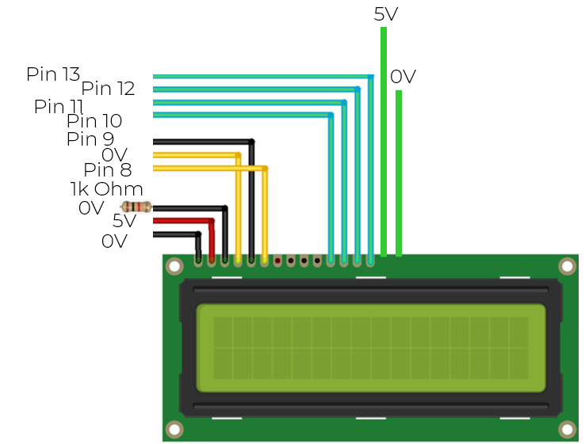

# Arduino Based Delta Robot with APP control

This project is a 3D printed small mockup robot controld by an arduino, using an ESP 8266-01 board for wifi interaction with an android APP. 

3 microservos are connected directly to the Arduino Uno.

Position data is sent to a small screen.

The robot can be moved using a small joystick.

The ESP 8266-01 will be programed to connect with an hotspot provided by the smartphone.

The APP (AndroidAPP/BotComander0.aia) was created using the MIT app inventor [at this url](https://appinventor.mit.edu/), but the same principles can be applied to other tech.stack.

### Note: the model was just a quick way to do a proof of concept but the basic priciples were validated.

 

 

